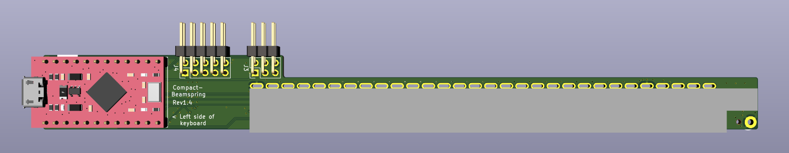
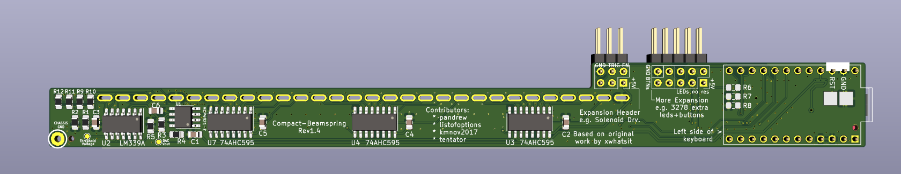

# Compact Beamspring controller.

This controller only supports new style card edge connectors only, and it requires the side
of the card edge connector to be cut off, and the pins be bent 90 degress.

This is a variant of the controller that also includes an additional expansion header, designed
especially for 3278 A02 / 3279 2C keyboards with a top panel, sporting additional leds and
non-capacitive push buttons.
See https://github.com/purdeaandrei/CompactBeamSpring/issues/1 for some details about these keyboards.

## Images

## Other controllers in this family:
* https://github.com/purdeaandrei/CompactBeamSpring
* https://github.com/purdeaandrei/SMDModelFController
* https://github.com/purdeaandrei/SMDModelFController/tree/extra_columns
* https://github.com/purdeaandrei/SMD4704KishsaverClassModelFController
* https://github.com/listofoptions/TH-XWhatsIt

## Origins and license

This project is based on the Through-hole xwhatsit by listofoptions, which is un turn
based on the capsense controllers by XWhatsIt
(Tom Wong-Cornall). original liscencure holds, as well as CERN OSH
(compatible license).

original implementation of Tom Wong-Cornall's controller documented here

http://downloads.cornall.co/ibm-capsense-usb-web/ibm-capsense-usb.html

Working theory of operation is under the previous link.

