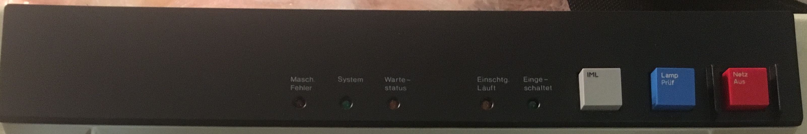
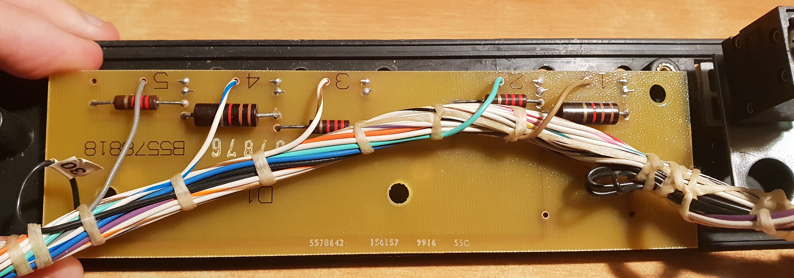
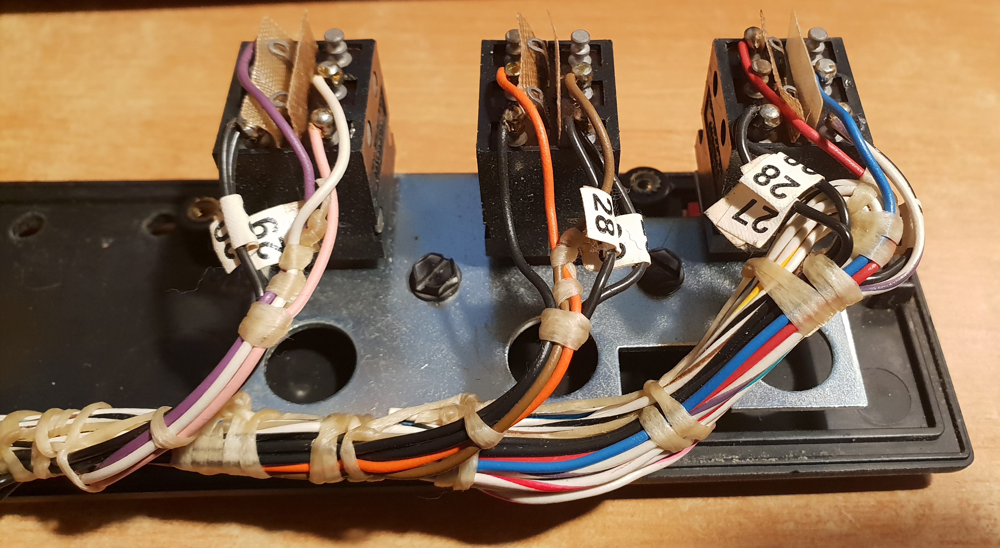
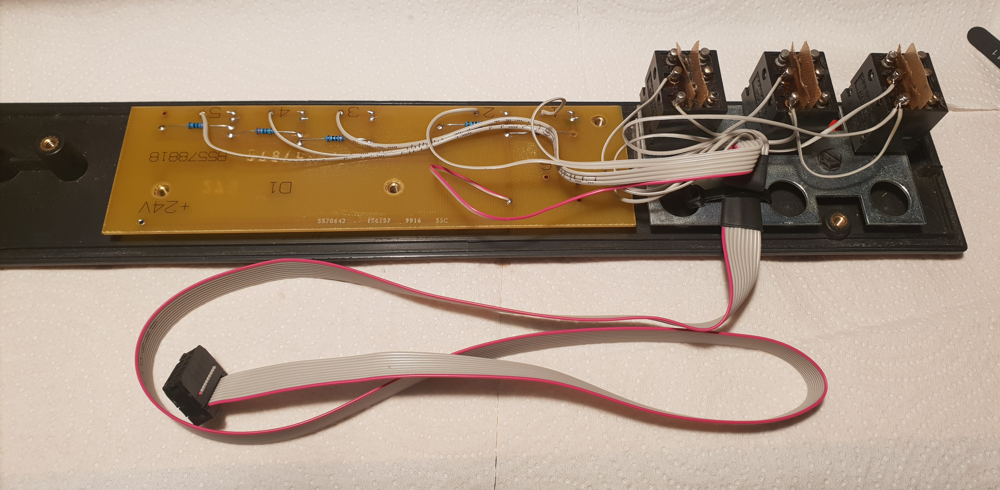
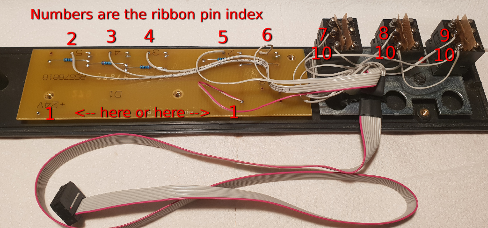
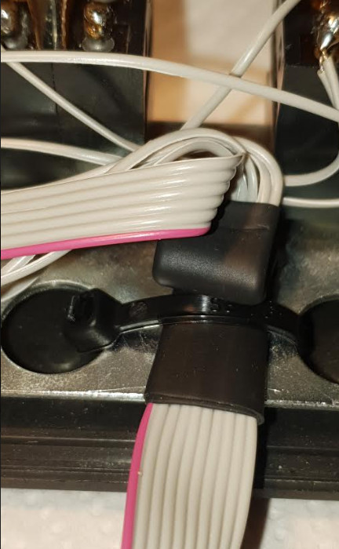
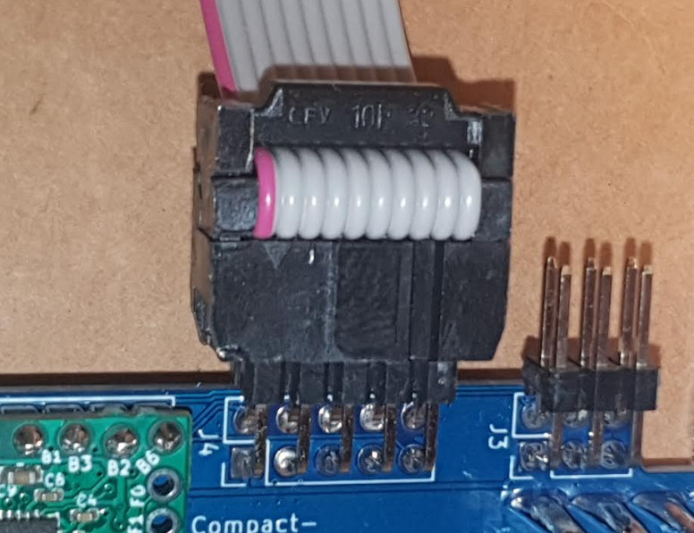

# Top panel modifications

This document describes how to modify the top panel of the 3278 A02 / 3279 2C keyboard shown below:

## The top panel in its original state

Note: for more details about the original state of the board, please see [here](images/original_wire_harness_leds_and_buttons.pdf), and [here](images/bottom_of_push_buttons_annotated.jpg).

## After the modifications, the bottom side of the top panel looks like this:

## Details

### Led Resistors

The original led board was designed to power the leds at 24 volts, so using the original current limiting resistors
at 5V, which is what our controller is running at, would make the leds too dim. In order to have the leds light at
a similar brightness as the original working condition of the keyboard, the resistors have to be replaced.

The following values have been calculated as recommended replacements. If you want to use these values
directly, please make sure that the board you're modifying had the same original resistor values as mentioned
in this table. Resistors are listed left-to-right:

| Led color | Index on PCB | Original resistor (@24V) | Recommended replacement (@5V) |
|-----------|--------------|--------------------------|-------------------------------|
| Red       | 5            | 2.2 kohm                 | 270 ohm                       |
| Green     | 4            | 1.1 kohm                 | 120 ohm                       |
| Yellow    | 3            | 2.2 kohm                 | 270 ohm                       |
| Yellow    | 2            | 2.2 kohm                 | 270 ohm                       |
| Green     | 1            | 1.1 kohm                 | 120 ohm                       |

Note: if you would like to see the raw spreadsheet we used to calculate the resistor values please see [here(.ods)](images/3278%20top%20panel%20led%20current%20limiting%20resistors.ods) or [here(.pdf)](images/3278%20top%20panel%20led%20current%20limiting%20resistors.pdf)

### New wire harness (using a ribbon cable)

#### Components

* 10-pin ribbon cable with 1.27mm pin pitch. We recommend using the single-color kind, that has only one edge wire with a different color. For example all-grey with pin "1" marked with red.
* 2x5-pin female IDC connector with 2.54mm pin pitch

Note: when crimping the IDC connector onto the ribbon cable, make sure to respect the pin 1 marker, which is usually a triangle/arrow showing which side pin 1 is on.

#### Wiring

| Ribbon pin index | Ribbon wire color | Controller net name | GPIO | Connect to                                             |
|------------------|-------------------|---------------------|------|--------------------------------------------------------|
| 1                | Red               | +5VD                |      | "+24V" pin on led board, which is the **common anode** |
| 2                | Grey              | LED1                | PF5  | "5" on PCB, The **left-most** led cathode              |
| 3                | Grey              | LED2                | PB4  | "4" on PCB, The second led cathode from the left       |
| 4                | Grey              | LED3                | PB5  | "3" on PCB                                             |
| 5                | Grey              | HEADER2_LED4        | PE6  | "2" on PCB                                             |
| 6                | Grey              | HEADER1_LED5        | PD7  | "1" on PCB, The **right-most** led cathode             |
| 7                | Grey              | BUTTON1             | PB6  | The **left-most** push buttons's middle-left terminal  |
| 8                | Grey              | BUTTON2             | PB3  | The middle push buttons's middle-left terminal         |
| 9                | Grey              | BUTTON3             | PF4  | The **right-most** push buttons's middle-left terminal |
| 10               | Grey              | GND                 |      | The bottom-left pins of **all 3 push-buttons**         |

Here is a futher illustrated image, explaining how to connecto the wires:

Here is an example of how to provide some strain relief to the ribbon cable using some heatshring tubing, and a cable tie:

#### Connecting to the controller

Always make sure the pin "1" of the ribbon cable (the side marked with red) is lined up with pin "1" on controller.
Note: pin 1 on the controller is the only pad that is square, and it's also marked differently on the silkscreen.

